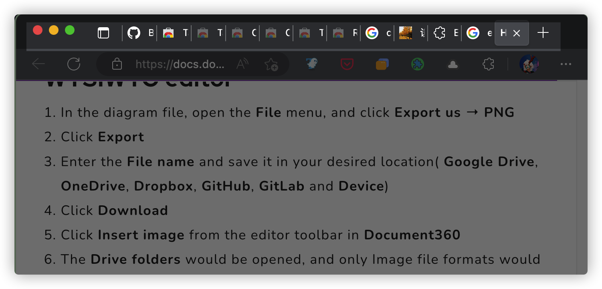
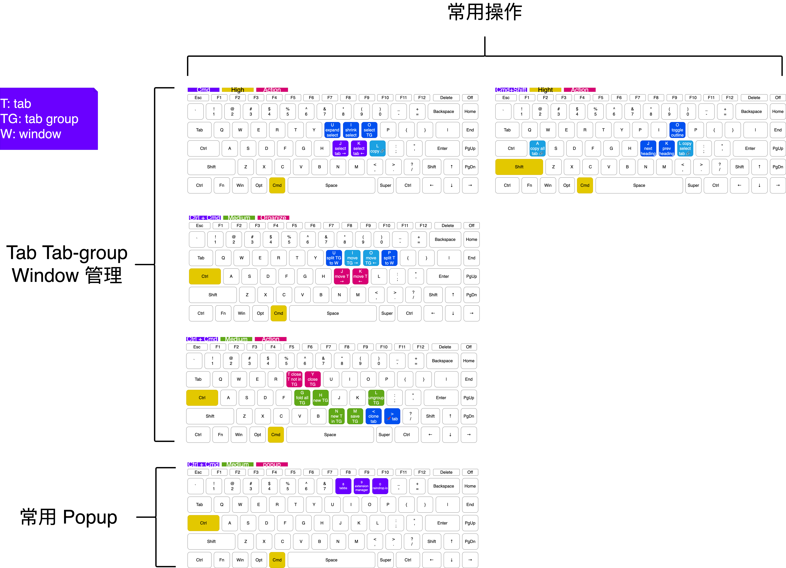

## 前言

浏览器是获取信息的重要工具，在我们研究复杂问题的过程中，会打开大量 tab。

然而有限的屏幕空间会让 tab 挤作一团，难以定位目标信息。



而且，由于浏览器缺乏快速且直观的分类手段，当短时间内打开多个 tab 时，我们往往会忘记 tab 之间的联系。

为解决以上问题，本文列举了若干插件，用以实现以下功能

1. 通过搜索快速定位 tab
2. 通过快捷键快速选择、组织、创建 tab 和 tab group
3. 复制 tab 和 tab group 信息为 markdown
4. 保存 tab

## 初始化

```bash
git clone https://github.com/HenryC-3/browser-tab-management.git
```

## 快捷键

> 放大查看具体键位



## 插件

| 插件/类别                                                                                                               | 简介                                                | 查看缺失的功能 | 查看 Bug |
| ----------------------------------------------------------------------------------------------------------------------- | --------------------------------------------------- | -------------- | -------- |
| [tabbs](https://chrome.google.com/webstore/detail/tabbs-tab-manager/cicnbbdlbjaoioilpbdioeeaockgbhfi)                   | 在 tabbs 面板中搜索、组织、保存 tab                 |                |          |
| [chrome tab renamer](https://chrome.google.com/webstore/detail/chrome-tab-renamer/jbjkejjogkedpjendhaccnccmeiafied)     | 重命名 tab                                          |                |          |
| [tab multi-selector](https://chrome.google.com/webstore/detail/tab-multiselect/enkfbbcigpbejipanohlnenfbaajoikc)        | 选择 tab 或 tab group 中的所有 tab                  |                |          |
| [tab groups extension](https://chrome.google.com/webstore/detail/tab-groups-extension/nplimhmoanghlebhdiboeellhgmgommi) | 使用快捷键组织 tab                                  |                |          |
| [copy as markdown](https://chrome.google.com/webstore/detail/copy-as-markdown/fkeaekngjflipcockcnpobkpbbfbhmdn)         | 根据当前选中的 tab 名称以及链接，生成 markdown 链接 |                |          |

## 提示

-   使用 tab group 组织相关 tab
-   当 tab group 数量过多时，将 tab group 拆分到新的浏览器窗口
-   使用 tabbs 执行以下操作
    -   检索 tab
    -   重命名 tab group
    -   移动 tab 到指定 tab group
